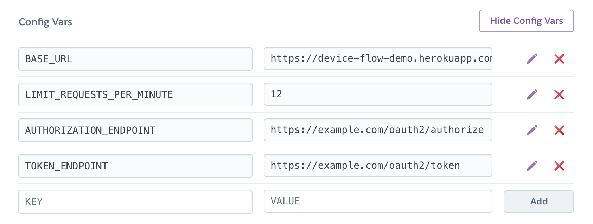

OAuth 2.0 Device Flow Proxy Server
==================================

A demonstration of the OAuth 2.0 Device Code flow for devices without a browser or with limited keyboard entry.

This service acts as an OAuth server that implements the device code flow, proxying to a real OAuth server behind the scenes.

Installation
------------

```
composer install
cp .env.example .env
```

In the `.env` file, fill out the required variables.

You will need to install Redis if it is not already on your system, or point to an existing redis server in the config file.

Define your OAuth server's authorization endpoint and token endpoint URL.

### Heroku Deploy

To deploy this in Heroku, you'll need to do the following:

Create a new Heroku application, and take note of the name.

Define environment variables in Heroku's admin interface based on the values from `.env.example` with the exception of `REDIS_URL`.



```
# Log in to your Heroku account
heroku login

# Define the Heroku upstream git repo from your app name
heroku git:remote -a oauth-device-flow-demo

# Enable Redis for your application
heroku addons:create heroku-redis:hobby-dev

# Deploy to Heroku
git push heroku master
```


Usage
-----

The device will need to register an application at the OAuth server to get a client ID. You'll need to set the proxy's URL as the callback URL in the OAuth application registration:

```
http://localhost:8080/auth/redirect
```

The device can begin the flow by making a POST request to this proxy:

```
curl http://localhost:8080/device/code -d client_id=1234567890
```

The response will contain the URL the user should visit and the code they should enter, as well as a long device code.

```json
{
    "device_code": "5cb3a6029c967a7b04f642a5b92b5cca237ec19d41853f55dcce98a4d2aa528f",
    "user_code": "248707",
    "verification_uri": "http://localhost:8080/device",
    "expires_in": 300,
    "interval": 5
}
```

The device should instruct the user to visit the URL and enter the code, or can provide a full link that pre-fills the code for the user in case the device is displaying a QR code.

`http://localhost:8080/device?code=248707`

The device should then poll the token endpoint at the interval provided, making a POST request like the below:

```
curl http://localhost:8080/device/token -d grant_type=urn:ietf:params:oauth:grant-type:device_code \
  -d client_id=1234567890 \
  -d device_code=5cb3a6029c967a7b04f642a5b92b5cca237ec19d41853f55dcce98a4d2aa528f
```

While the user is busy logging in, the response will be

```
{"error":"authorization_pending"}
```

Once the user has finished logging in and granting access to the application, the response will contain an access token.

```json
{
  "access_token": "FmcTZiYmJzeWpoeTdUSTBoNyIsInVpZCI6IjAwdWJ1NG1",
  "token_type": "Bearer",
  "expires_in": 7200
}
```
